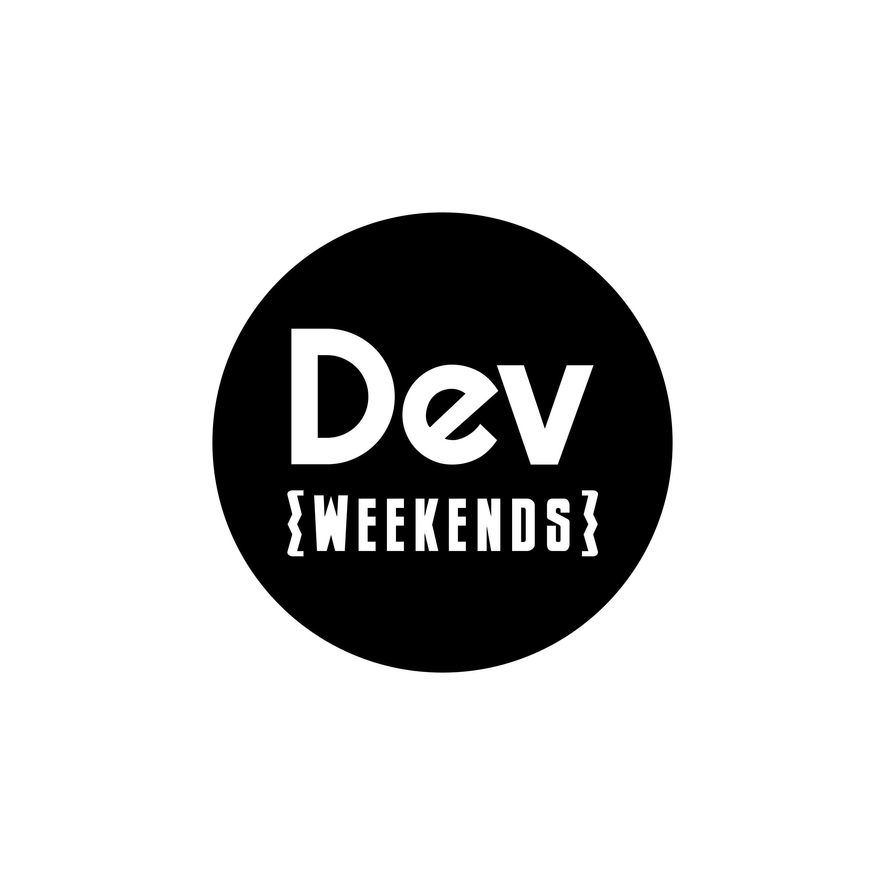

<p align="center">
  
</p>

<h1 align="center">Dev Weekends Web Platform</h1>

<p align="center">
  <strong>Your Gateway to Becoming a Better Software Engineer</strong>
</p>

<p align="center">
  <a href="LICENSE"></a>
  <a href="https://github.com/devweekends/web-platform/issues"></a>
  <a href="https://github.com/devweekends/web-platform/pulls"></a>
  <a href="CONTRIBUTING.md"></a>
</p>

<p align="center">
  <a href="#-about">About</a> •
  <a href="#-features">Features</a> •
  <a href="#-tech-stack">Tech Stack</a> •
  <a href="#-getting-started">Getting Started</a> •
  <a href="#-project-structure">Project Structure</a> •
  <a href="#-contributing">Contributing</a> •
  <a href="#-community">Community</a> •
  <a href="#-license">License</a>
</p>

---

## 📖 About

The **Dev Weekends Web Platform** powers the public website and internal portals for the [Dev Weekends](https://devweekends.com) community – a thriving tech community focused on mentorship in software engineering, DevOps, cloud computing, and machine learning/AI.

This platform serves:
- **Public visitors** – Explore sessions, mentors, resources, and community events
- **Mentors** – Manage mentees, track progress, and share resources
- **Ambassadors** – Coordinate community activities and outreach
- **Admins** – Oversee the entire platform, manage users, sessions, and content

## ✨ Features

- 🎓 **Mentorship Program** – Connect mentors with mentees for personalized guidance
- 📅 **Session Management** – Schedule and manage community learning sessions
- 👥 **Community Portal** – Showcase mentors, ambassadors, and community members
- 📚 **Resource Library** – Curated learning resources for the community
- 🎯 **MindMaster** – Interactive challenges and learning activities
- 🔐 **Role-Based Access** – Secure portals for Admin, Mentor, and Ambassador roles
- 📊 **Activity Tracking** – Monitor community engagement and progress
- 🌙 **Dark/Light Mode** – Beautiful UI with theme support

## 🛠 Tech Stack

| Category | Technology |
|----------|------------|
| **Framework** | [Next.js 15](https://nextjs.org/) (App Router) |
| **Language** | [TypeScript](https://www.typescriptlang.org/) |
| **Styling** | [Tailwind CSS](https://tailwindcss.com/) |
| **UI Components** | [Radix UI](https://www.radix-ui.com/) |
| **Database** | [MongoDB](https://www.mongodb.com/) via [Mongoose](https://mongoosejs.com/) |
| **Authentication** | Custom JWT-based auth |
| **Media Storage** | [Cloudinary](https://cloudinary.com/) |
| **Analytics** | [Google Analytics](https://analytics.google.com/) |

## 🚀 Getting Started

### Prerequisites

- **Node.js** 20+ (LTS recommended)
- **npm** (or yarn/pnpm/bun)
- **MongoDB** instance (local or [MongoDB Atlas](https://www.mongodb.com/atlas))
- **Git**

### Installation

1. **Fork the repository** (for contributors)

   Click the "Fork" button at the top right of this page.

2. **Clone the repository**

   ```bash
   git clone https://github.com/YOUR_USERNAME/web-platform.git
   cd web-platform
   ```

3. **Install dependencies**

   ```bash
   npm install
   ```

4. **Configure environment variables**

   ```bash
   cp .env.example .env.local
   ```

   Edit `.env.local` and fill in your values. See [Environment Variables](#environment-variables) for details.

5. **Start the development server**

   ```bash
   npm run dev
   ```

6. **Open your browser**

   Navigate to [http://localhost:3000](http://localhost:3000)

### Environment Variables

Create a `.env.local` file based on `.env.example`:

| Variable | Required | Description |
|----------|----------|-------------|
| `MONGODB_URI` | ✅ | MongoDB connection string |
| `JWT_SECRET` | ✅ | Secret key for JWT token signing |
| `ADMIN_ACCESS_CODE` | ✅ | Access code for admin authentication |
| `MENTOR_ACCESS_CODE` | ✅ | Access code for mentor authentication |
| `AMBASSADOR_ACCESS_CODE` | ✅ | Access code for ambassador authentication |
| `NEXT_PUBLIC_GA_ID` | ❌ | Google Analytics measurement ID |
| `CLOUDINARY_CLOUD_NAME` | ❌ | Cloudinary cloud name for media uploads |
| `CLOUDINARY_API_KEY` | ❌ | Cloudinary API key |
| `CLOUDINARY_API_SECRET` | ❌ | Cloudinary API secret |

> ⚠️ **Security Note**: Never commit your `.env.local` file or expose secrets in your code.

### Available Scripts

| Script | Description |
|--------|-------------|
| `npm run dev` | Start development server with Turbopack |
| `npm run build` | Build for production |
| `npm start` | Start production server |
| `npm run lint` | Run ESLint |

## 📁 Project Structure

```
web-platform/
├── app/                    # Next.js App Router
│   ├── (public pages)/     # Public pages (home, about, sessions, etc.)
│   ├── admin/              # Admin dashboard & management
│   ├── ambassador/         # Ambassador portal
│   ├── mentor/             # Mentor portal
│   ├── api/                # API routes
│   ├── layout.tsx          # Root layout
│   └── globals.css         # Global styles
├── components/             # React components
│   ├── ui/                 # Primitive UI components (Radix-based)
│   └── *.tsx               # Feature components
├── lib/                    # Shared utilities
│   ├── db.ts               # MongoDB connection
│   ├── auth.ts             # Authentication helpers
│   ├── jwt.ts              # JWT utilities
│   └── utils.ts            # General utilities
├── models/                 # Mongoose models
├── public/                 # Static assets
└── types/                  # TypeScript type definitions
```

## 🤝 Contributing

We love contributions! Dev Weekends is built by the community, for the community.

### Quick Start

1. Fork the repository
2. Create a feature branch: `git checkout -b feature/amazing-feature`
3. Make your changes
4. Run linting: `npm run lint`
5. Commit your changes: `git commit -m 'Add amazing feature'`
6. Push to the branch: `git push origin feature/amazing-feature`
7. Open a Pull Request

### Resources

- 📖 **[Contributing Guide](CONTRIBUTING.md)** – Detailed contribution guidelines
- 🐛 **[Bug Report](https://github.com/devweekends/web-platform/issues/new?template=bug_report.md)** – Report a bug
- 💡 **[Feature Request](https://github.com/devweekends/web-platform/issues/new?template=feature_request.md)** – Suggest a feature
- 📜 **[Code of Conduct](CODE_OF_CONDUCT.md)** – Community guidelines
- 🔒 **[Security Policy](SECURITY.md)** – Report security vulnerabilities

### Good First Issues

Looking for a place to start? Check out issues labeled [`good first issue`](https://github.com/devweekends/web-platform/labels/good%20first%20issue) – they're perfect for newcomers!

## 👥 Community

Join our vibrant community of developers, mentors, and tech enthusiasts!

- 🌐 **Website**: [devweekends.com](https://devweekends.com)
- 🔗 **Linktree**: [linktr.ee/DevWeekends](https://linktr.ee/DevWeekends)
- 📺 **YouTube**: [Dev Weekends](https://www.youtube.com/@DevWeekends)
- 💼 **LinkedIn**: [Dev Weekends](https://www.linkedin.com/company/devweekends)
- 🐦 **Twitter**: [@devweekends](https://twitter.com/devweekends)

## 🙏 Acknowledgments

A huge thank you to:
- All our amazing **mentors** who volunteer their time
- Our dedicated **ambassadors** who spread the word
- Every **community member** who participates and contributes
- All **open source contributors** who help improve this platform

## 📄 License

This project is licensed under the **MIT License** – see the [LICENSE](LICENSE) file for details.

---

<p align="center">
  Made with ❤️ by the <a href="https://devweekends.com">Dev Weekends</a> community
</p>
